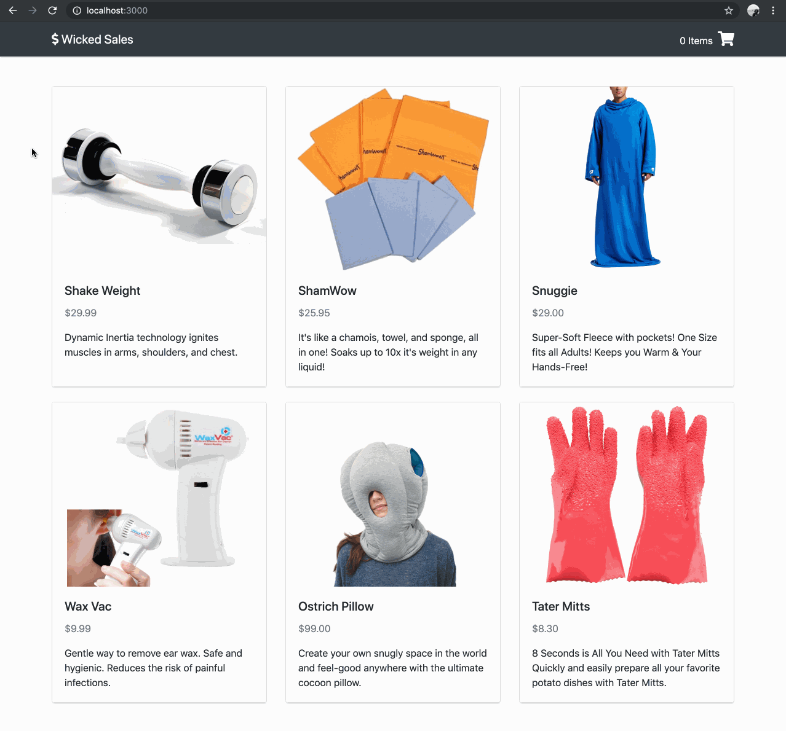

# User can add a product to their cart - Front End.

## Implementation

For this feature you will be adding a button to your product details view so the user can add that product to their cart. The cart should persist between screen refreshes.

## Tips

When you are modifying existing components, hard-code your `App`'s state to always show the view you are working on. That way you don't have to keep clicking your user interface to finally see your changes.

Use the React Dev Tools in your browser to inspect the state and props of your components as you interact with them.

## Example

  

### 💰 Motivation

If a user likes an item, then they should be able to buy it!

### 🖼 Figma

The Figma for this feature can be found [here](https://www.figma.com/file/BKByCT0h5swDTLY1XHGibRRr/wicked-sales?node-id=11%3A13).

### ✅ Task List

- Check out a branch from `master` named `add-to-cart-front-end`.
- Add an initial state property to `App` named `cart` set to an empty `Array`.
- Define a method in `App` named `getCartItems` that retrieves the user's cart items with a `GET` request to `"/api/cart"`
- Load all of the user's cart items from the server by calling `getCartItems` in `App`'s `componentDidMount` method.
- Modify `Header` to receive a `cartItemCount` prop that is the number of items in `App`'s `cart` state. `Header` should display a shopping cart icon with the number of items in the user's cart.
- Define a method in `App` named `addToCart` with one parameter, `product`, which is a product `Object`. `addToCart` should `POST` the product to `"/api/cart"` before adding it to the `App`'s `cart` state.
- Modify `ProductDetails` to include an "Add to Cart" button.
- In `App`'s render method, pass `App`'s `addToCart` method to `ProductDetails` via props so that when a user clicks the "Add to Cart" button, the product is added to the cart.
- Push all commits to `origin add-to-cart-front-end`.
- Open a Pull Request from `add-to-cart-front-end` to `master`.
