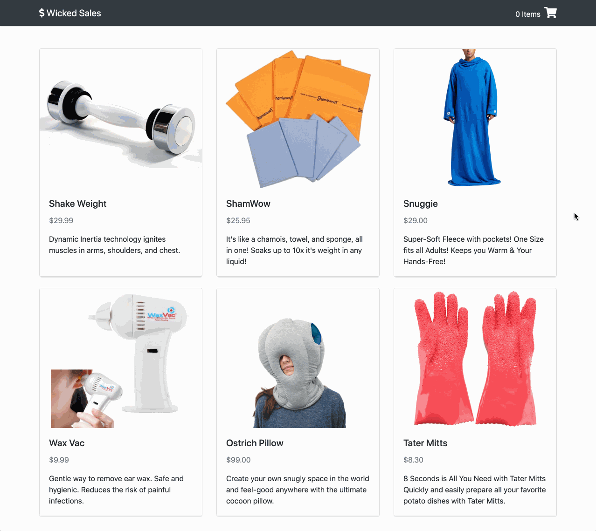

# User can view their cart summary - Front End.

## Implementation

For this feature you will be adding another view that the user can visit. When they click on their shopping cart, they should be able to see a list of items they've added.

## Tips

When you are creating new components, hard-code your `App`'s state to always show the view you are working on. That way you don't have to keep clicking your user interface to finally see your changes. It saves a lot of time!

Use the React Dev Tools in your browser to inspect the state and props of your components as you interact with them.

Use the Network tab of your Dev Tools to confirm the data that you are receiving from the back end.

## Example

<p align="middle">
  
</p>

### 💰 Motivation

Users will want to see all of the items they're buying as well as the total cost before they decide to make their purchase.

### Figma

The Figma for this feature can be found [here](https://www.figma.com/file/BKByCT0h5swDTLY1XHGibRRr/wicked-sales?node-id=11%3A36).

### Task List

- Check out a branch from `master` named `view-cart-summary-front-end`.
- Define a stateless `CartSummaryItem` component that takes a cart `item` via props and displays the `item`'s image, name, price, and short description.
- Define a stateless `CartSummary` component that takes an `Array` of cart items via props and renders a list of `CartSummaryItems`. `CartSummary` should also have a heading for the list and display the total price of all cart items. If there are no items in the cart, then `CartSummary` should display a message to the user.
- Add `CartSummary` to `App`'s render method, passing it `App`'s `cart` state via props. `CartSummary` should be conditionally rendered depending on whether `App`'s `view.name` state is `"cart"`.
- In `App`'s render method, pass `setView` to `Header` so that when the user clicks the shopping cart icon, the `App`'s view state changes to `{ name: "cart", params: {} }`.
- Allow the user to return to the catalog view from their shopping cart summary by clicking "< Back to catalog".
- Push all commits to `origin view-cart-summary-front-end`.
- Open a Pull Request from `view-cart-summary-front-end` to `master`.
```
