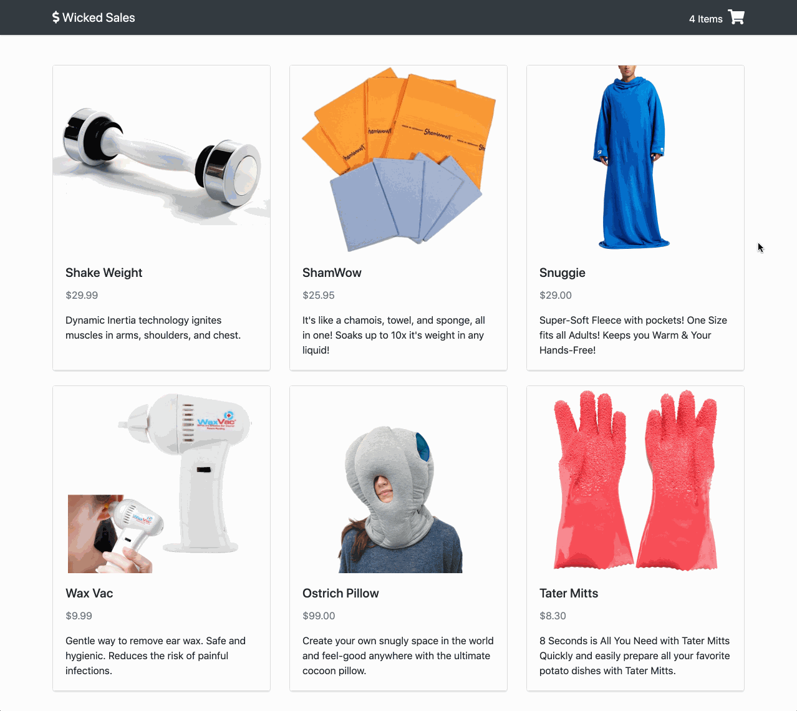

# User can place an order - Front End.

## Implementation

For this feature you will be adding another view that the user can visit. If they have any items in their cart, they should be able to submit their name, payment info, and shipping address to place their order.

## Tips

When you are creating new components, hard-code your `App`'s state to always show the view you are working on. That way you don't have to keep clicking your user interface to finally see your changes. It saves a lot of time!

Use the React Dev Tools in your browser to inspect the state and props of your components as you interact with them.

Use the Network tab of your Dev Tools to confirm the data that you are sending to the back end.

## Example

<p align="middle">
  
</p>

### 💰 Motivation

Getting paid!

### 🖼 Figma

The Figma for this feature can be found [here](https://www.figma.com/file/BKByCT0h5swDTLY1XHGibRRr/wicked-sales?node-id=17%3A0).

### ✅ Task List

- Define a method in the `App` component named `placeOrder` that takes an `Object` with `name`, `creditCard`, and `shippingAddress` properties and sends them in a `POST` request to `"/api/orders"` before resetting `App`'s `cart` state to an empty `Array`. `placeOrder` should also change the `App`'s `view` state back to `{ name: 'catalog', params: {} }`
- Define a stateful `CheckoutForm` component with two inputs for the user's name and credit card number, along with a text area for the user's shipping address.
- Modify `CartSummary` to include a button that changes the `App`'s `view` state to `{ name: 'checkout', params: {} }` (if the user has added any items to their cart).
- Modify `App`'s render method to conditionally render the `CheckoutForm`, depending on whether the `App`'s `view.name` is `"checkout"`. `App` should pass `placeOrder` to `CheckoutForm` via props.
```
